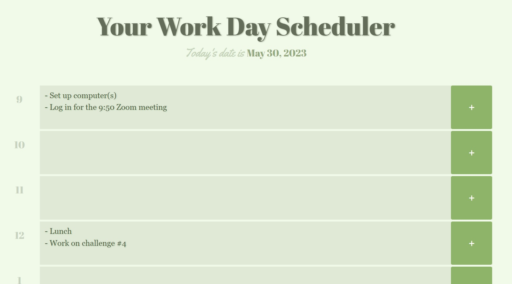

# Daily-Scheduler

## Description

This project was built using initial files provided by Denver University's Coding Boot Camp as part of a challenge assignment due 5/29. The assignment required me to make the provided daily work scheduler starter code operational by providing the user with local storage functionality to save their entries, the current date displayed in the page's header, and color coded text areas for aesthetics and convenience.

Additional requirements included the following criteria:

> - Uses a date utility library to work with date and time
> - Repository includes more than just a unique name
> - Application deployed at live URL
> - Application loads with no errors
> - GitHub repository that contains application code
> - Application user experience is intuitive and easy to navigate
> - Application user interface style is clean and polished
> - Application resembles the provided mock-up functionality

## Installation

N/A

## Usage

To use this work day scheduler, navigate to https://msjamesm.github.io/Daily-Scheduler in your browser. Select the time block you would like to add a note to and click anywhere within the chosen text area. When you are finished writing your note, click the green <b>"+"</b> button to the right of the page. The notes you entered will still be saved if you navigate away from the page.

## Screenshot

## Credits

There were no other contributors to this project and no third-party material was used outside the material provided by Denver University's Coding Boot Camp (in partnership with edX).

## License

N/A
